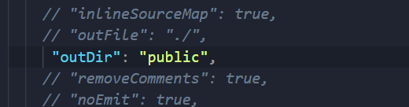
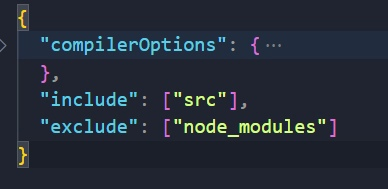

# :green_book: Документация

<p>
Привет, друг! Ты попал в мой репозиторий, и походу у тебя появилось желание подтянуть знания по TS вместе со мной. В этом репозитории я постараюсь более подробно описать каждый момент, написанный на TS, и дать возможность тебе, разобраться в TS. Это не единственный проект, в скором времени, я добавлю еще образовательные проекты, которые ты сможешь посмотреть. Под этим текстом будет блок навигации!
</p>

## :memo: Навигация по репозиториям
<ul>
    <li><a href='#'>link</a></li>
</ul>

### Настройка проекта

<p>
Сперва, что тебе нужно сделать, это создать папку на рабочем столе и закинуть ее в свой редактор кода. Далее тебе нужно зайти в терминал bash ( Я надеюсь у тебя установлена Node ), и там инициализировать свой проект:
</p>

###### :heavy_dollar_sign: bash
```
$ npm init -y
```

<p>
Далее устанавливаем TypeScript в свой проект.
</p>

###### :heavy_dollar_sign: bash
```
$ npm i -D typescript
```
<p>
Теперь нужно создать файл конфигурации ts, для этого достаточно запустить файл tsc из папки node_modules, и файл tsconfig отобразится в файловой структуре.
</p>

###### :heavy_dollar_sign: bash
```
$ ./node_modules/.bin/tsc --init
```

<p>
Для запуска сборщика в консоли прописываем команду для запуска. Либо же можете запустить эту команду в сценариях npm (если ты используешь VScode)
</p>

###### :heavy_dollar_sign: bash
```
$ npm start
```

#### Настройка конфигурации

<p>
Теперь приступим к настройке конфига. Если ты ранее работал с таким сборщиком как Webpack, то ты вероятно знаешь, что такое точка входа и выхода. В конфигурации нам так же нужно прописать, куда будут компилироваться наши TS файлы, директория с исходными файлами, и настройка для node_modules.
Заходим в файл tsconfig.json и ищем свойство с названием "outDir". Это точка где будет лежать уже скомпилированный код.
</p>



<p>
 Затем под свойством compilerOptions, мы пропишем еще два свойства. Include помечает наши исходные файлы, которые будут компилироваться в publick, а exclude делает исключение, что бы из папки node_modules не компилировалось ничего лишнего.
</p>




### :clipboard: Навигация по записям
<ul>
    <li><a href='#02'>Функции в TS</a></li>
</ul>

### :bookmark_tabs: Примитивы
<p id='01'>
Перед началом, описания этого модуля, давай поговорим с тобой про типы. Что же такое тип ? На самом деле тут все просто.
Когда ты создаешь переменную и заносишь в нее какое-то значение, ты присваиваешь какой-то тип этой переменной, то есть, если в переменно будет лежать число 10, 
то переменная будет иметь тип number и т.д. Но так же хочу отметить, что тут есть один интересный момент, который важно понимать. JavaScript, не имеет строгой типизации, поэтому 
ты можешь делать с переменной что угодно. Сегодня в этой переменной лежит строка, завтра число,
 через неделю массив, и это не всегда хорошо. TypeScript предотвращает такое действие, и вот пример:
</p>

###### TypeScript
```
let num = 10 // при наведении курсора на переменную, будет показан установленный тип "number" (число)

// редактор кода, будет отображать методы для этой переменной, которые могут быть использованы только с типом number

num.trim() - ошибка, Свойство "trim" не существует в типе "number"
// таким образом, мы не можем применять методы для строки, к переменной с типом "number"

let num = [] - ошибка, Тип "never[]" не может быть назначен для типа "number"
// так же получим ошибку, ибо ранее нашей переменной был задан тип "number"
```
<p>
Может показаться, что это все ерунда, и зачем вообще это надо. Дело в том, что TypeScript покажет тебе эти ошибки
внутри редактора кода, что очень полезно на стадии разработки. Вы не будете держаться за голову, смотря в окно консоли, и думать, в чем же может быть ошибка, TS предупредит, если какие-то операции не допустимы для переменной.
</p>

#### :diamonds: Тип number
<p>
Мы уже с тобой выяснили, что переменная содержащая внутри себя число, будет иметь тип "number", но есть еще пару вещей которые ты должен знать
</p>

###### TypeScript
```
let typeNan = NaN - тип этой переменной будет "number"
```
<p>
Почему так происходит? Дело в том, что в JavaScript NaN является подтипом числового типа "number". Это немного странно, но так устроен JavaScript. И вот еще один интересный пример: 
</p>

###### TypeScript
```
let bigNum = 12345n - тип этой переменной будет "bigint"
```
<p>
Здесь уже все намного логичнее, большие целочисленные значения всегда будут иметь тип bigint, что в JS, что в TS, но самое интересное кроется в другом месте.
TypeScript будет ругаться на переменную такого типа, связано это с тем, что в настройках конфигурации установлено нацеливание на версию
ECMAScript (ES) ниже 2020 года, а поддержка переменных с типом "bigint", начинается только с 20 года. Это нужно учитывать в своих проектах.
</p>

#### :diamonds: Тип String
<p>
Со строками все намного проще. Но есть момент, который также нужно учитывать
</p>

###### TypeScript
```
let str = 'Alex' - тип string, ибо это строка

let symb = Symbol('dsds') - тип Symbol

let customStr = str + symb // Оператор "+" невозможно применить к типу Symbol
```

<p>
И да, символы нельзя складывать со строкой, потому, что символы не переводятся автоматически в строку при конкатенации со строкой, что тоже в принципе очевидно. Для этого придется использовать метод
toString() для Symbol, что бы привести символы к строке.
</p>

#### :diamonds: Тип Boolean

<p>
Смысла разбирать этот тип, я не вижу. Если в переменной лежит "true" или "false", то переменная будет иметь тип boolean, и кроме как
булевое значение, в нее занести ничего не получится.
</p>

#### :diamonds: Тип Nothing

<p>
Как такового типа Nothing в TS не существует, но что тогда это значит. Nothing - значит ничего, а к этому слову можно сопоставить
такие значение как "undefined" и "null". Это будет верное определение, но ты можешь заметить, что TS помечает переменные с этим значением
как "any" и это можно исправить.
</p>

###### TypeScript
```
let undefinedValue: undefined = undefined
let nullValue: null = null
```
<p>
Таким образом я явно указал тип переменных. Но тогда возникает вопрос, почему ранее я не указывал тип через: для переменной. Дело в том,
что TS обладает довольной сильной системой авто вывода типов, и поэтому для строк, чисел, и булевых значений не обязательно указывать
явную типизацию.
</p>

#### :diamonds: Универсальный тип (any)
<p>
Да, "any", это тот самый тип, который позволяет нам делать все что угодно с переменной.
</p>

###### TypeScript
```
let anyType: any = 1
anyType = 'str'
anyType = []
```
<p>
Мы можем переопределять значение переменной как угодно, но это не безопасно для выполнения операций и вычислений, поэтому лучше
использовать явные типы, и придерживать только их.
</p>

#### :diamonds: Тип unknown

<p>
Тип "unknown" говорит о том, что мы не знаем, какого типа может быть переменная. Указывая такой тип, редактор кода также не будет
предлагать никаких методов для этой переменной, ибо он просто не знает что это за тип. И вот как можно поступить в данной ситуации, 
когда мы не знаем, какой тип у переменной: 
</p>

###### TypeScript
```
let unk: unknown = 1

unk = 'hello';
if(typeof unk === 'string') unk.toUpperCase()
```
<p>
Таким образом, если тип переменной будет строка, то тогда применится метод toUpperCase()
</p>

#### :diamonds: Литералы
<p>
На протяжении всего этого модуля, ты мог заметить, что я использовал только let переменные, но как же быть с const.
Константа, не может быть перезаписана, поэтому у нее не будет конкретного типа, а тип будет в себе содержать значение константы.
Константа(Литерал) - одно конкретное значение!
</p>

###### TypeScript
```
const num = 1000 - ты не увидешь типа number, ибо это константа, типом будет ее значение: 1000
```

### :bookmark_tabs: Функции в TypeScript

<p id='02'>
В этом модуле, я покажу как можно типизировать функции, покажу несколько новых типов, ну и затронем немного тему связанную с массивами.
</p>

#### :diamonds: Типизация параметров и возвращаемое значение

###### TypeScript
```
const sumFunc = (a: number, b: number): number => {
    return a + b
}
sumFunc(5, 5)
```
<p>
И так, момент номер 1: Принимаемые параметры в функции всегда нужно типизировать! В данном случае параметры <i>a</i> и <i>b</i> имеют тип number. Если этого не сделать, то TS будет ругаться, и предупреждать нас о не явном типе параметра. Так же хочу заметить, что если ты ожидаешь два параметра внутри функции с типом "number", то при вызове этой функции ты так же должен передать два числа! TS не пропустить значение с каким либо другим типом. Так же если будет передано одно значение, то TS предупредит нас о не хватке еще одного значения.
</p>

<p>
Момент номер 2: ты мог заметить, что после скобок с параметрами, у меня есть еще одно указание типа "number", но для чего оно ? Типизация в этом месте нужна для того, что бы указать, какой тип данных нам возвращает эта функция. Делать это не всегда обязательно, TS это делает автоматически, но иногда может потребоваться указать явный тип. Но что если функция ничего не возвращает, не делает return? Ответ прост - TS задаст тип void для такой функции, и вот пример с явной типизацией:
</p>

###### TypeScript
```
const logger = (name: string): void => { // здесь я явно указал этот тип, для наглядности
    console.log(`hello, my name is ${name}`);
}

logger('Alex')
```
<p>
Таким образом мы указали, что функция завершается, без возврата какого-либо значения. Теперь давай разберемся с типом "never" у функций.
</p>

#### :diamonds: Тип never

###### TypeScript
```
const crashFunc = (): never => {
    throw new Error('crash')
}

const infiniteLoop = (): never => {
  while (true) {
    console.log("This is an infinite loop!");
  }
}
```
<p>
Тип "never" используется для представления значений, которые не должны произойти, или никогда не будут иметь значения. В примере выше я написал функцию с ошибкой и бесконечный цикл. В данной ситуации ни одна функция не завершится нормально, а значит ничего не вернет, и как такового результата не будет. Но на самом деле это глупый пример, ибо никто не будет писать функции с допусканием таких ошибок. Never чаще используется в комбинированных типах, о которых ты узнаешь чуть позже. 
</p>

#### :diamonds: Оператор Spread

<p>
Может сложиться такая ситуация, что ты не знаешь, сколько параметров будет передано в функцию, и ты используешь оператор rest, оператором расширения. Все круто, казалось бы, но после написания оператора, ты словишь ошибку типа: "Параметр rest "services" неявно имеет тип any[]". Упс, не состыковка. Вот пример того, как можно решить эту проблему:
</p>

###### TypeScript
```
const sumService = (...services: number[]) => {
    const sumServices = services.reduce((current, total) => current + total, 0)

    return sumServices / 10
}
```
<p>
Для решения ошибки, достаточно указать тип сущностей, которые будут лежать в массиве. В данной случаем я считаю стоимость всех услуг, поэтому я точно знаю, что в массиве будут лежать стоимости разных услуг, а значит тип "number[]". Да, не всегда могут приходить параметры одного типа, и массив может состоять из чего угодно, из вложенных массивов, объектов и т.д, но это уже тема следующего модуля.
</p>

#### :diamonds: Не обязательные параметры.

<p>
Не обязательный параметр, это параметр, который как бы есть, но его может не быть. Вот пример такой функции с необязательным параметром.
</p>

###### TypeScript
```
const logger = (name: string, userId?: string): void => {
    console.log(`hello, my name is ${name}`);
}

logger('Alex')
```
<p>
Ты можешь заметить, что я указал всего лишь один параметр при вызове функции logger, и это правильно, ошибки никакой не будет. Происходит это потому что я прописал для userId "?". Вопросительный знак перед: означает, что этот параметр не обязателен, его могут как передать, так и нет.
</p>


